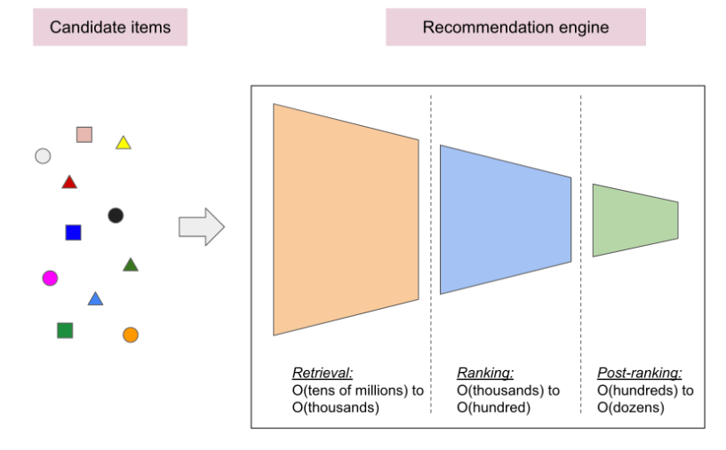

# fullstack_movie_recommendation_system
 TensorFlow 

#Retrieval (alma) ve raking(sıralama) modelleri
1.) Geri alma (retrieval) aşaması, olası tüm adaylar arasından yüzlerce adaydan oluşan bir başlangıç ​​kümesinin seçilmesinden sorumludur.Bu modelin temel amacı, kullanıcının ilgilenmediği tüm adayları verimli bir şekilde ayıklamaktır. Alma modeli milyonlarca adayla ilgilenebileceğinden, hesaplama açısından verimli olmalıdır.

2.) Sıralama aşaması (ranking), erişim modelinin çıktılarını alır ve mümkün olan en iyi bir avuç öneriyi seçmek için bunları ayarlar. Görevi, kullanıcının ilgilenebileceği öğe kümesini, yüzlerce sıradaki olası adayların kısa bir listesine daraltmaktır. 

3.) Sıralama sonrası (post-ranking) aşama , aday öğelerini düzinelerce sıralı bir dizi yararlı öneride yeniden düzenler.

